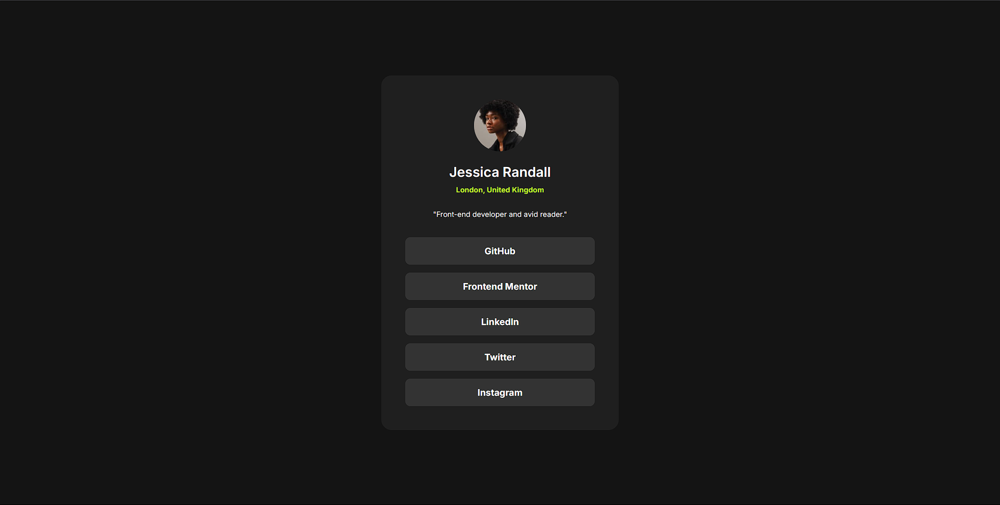

# Frontend Mentor - Social links profile solution

This is a solution to the [Social links profile challenge on Frontend Mentor](https://www.frontendmentor.io/challenges/social-links-profile-UG32l9m6dQ).

## Overview

### The challenge

Users should be able to:

- See hover and focus states for all interactive elements on the page

### Screenshot

### Links

- Solution URL: [Add solution URL here](YOUR_SOLUTION_URL)
- Live Site URL: [Add live site URL here](YOUR_LIVE_SITE_URL)

## My process

### Built with

- Semantic HTML5 markup
- CSS custom properties
- Flexbox
- Mobile-first workflow

### What I learned

This project helped reinforce my understanding of basic HTML structure and CSS styling, particularly with layout using Flexbox and the use of CSS custom properties for managing styles. I also practiced implementing hover states for interactive elements.

### Continued development

In future projects, I aim to focus more on responsive design principles to ensure layouts adapt well to different screen sizes. I also want to explore more advanced CSS techniques and potentially incorporate CSS animations for enhanced user interaction.

## Author

- Frontend Mentor - [@souledspirit](https://www.frontendmentor.io/profile/souledspirit)

## Acknowledgments

Thank you to Frontend Mentor for providing this engaging challenge!
